# Pavel Švec

Desktop tools, embedded hardware and utilities for Linux/KDE.

## Public projects

### [Svec Studio Fedora theme](https://github.com/pauliquib/svec-studio-fedora-theme)
A set of tools for the look of Fedora with KDE Plasma 6, in one repository. Each part is standalone:

- **Panel & Window Colours** — a native settings module (KCM) for panel, title bar, border and shadow colours, plus saved themes with a live preview (`colors/`)
- **Outline Icons** — an outline icon set; the Accent variant follows the Plasma accent colour, plus fixed White and Black (`icons/`, Python, freedesktop)
- **Expanding Icons Task Manager** — an icon-only task manager; the icon under the cursor smoothly expands into a label with the window title and neighbouring icons move aside. It is a port of the app rail from the svec-elektro.cz header. Icons and labels stay readable on any background thanks to a contrast outline from a custom shader (`taskbar/`, QML, GLSL, KDE Plasma 6 widget)
- **Plasma Search Bar** — a VS Code–style command palette in the KDE panel: live KRunner results and prefix modes (`>` terminal, `/` files, `:` system actions, `!` web, `?` help), aliases, recent items and configurable features (QML, KDE Plasma 6 widget) (`search-bar/`)

<table>
<tr>
<td width="33%" valign="top"><a href="https://github.com/pauliquib/svec-studio-fedora-theme/tree/main/icons">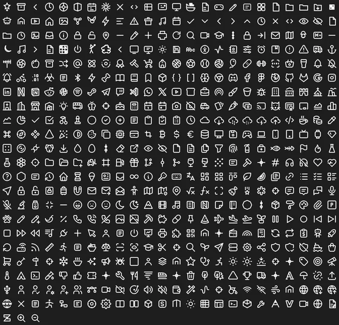</a></td>
<td width="33%" valign="top">
 
 

 

</td>
<td width="33%" valign="top"></td>
</tr>
</table>

### [Stone & Clay](https://github.com/pauliquib/stone-and-clay)
An open-world simulator of the village of Dukelčice on a real cadastral map — NPC dialogue, work, skills, weather, wildlife, flying (Godot 4.3, GDScript)

<a href="https://github.com/pauliquib/stone-and-clay">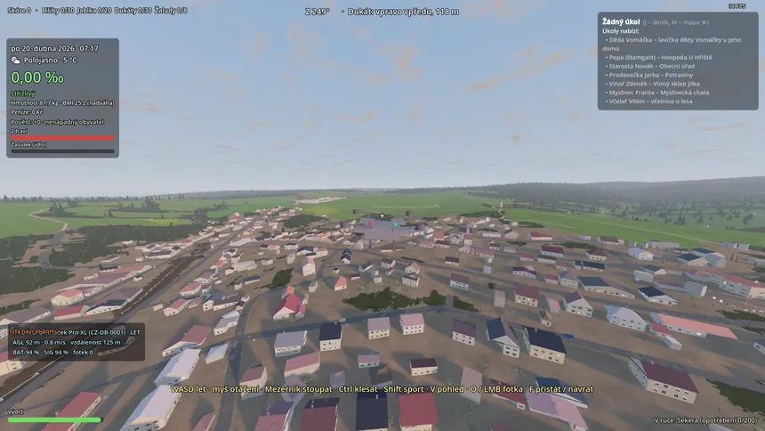</a>
<a href="https://github.com/pauliquib/stone-and-clay">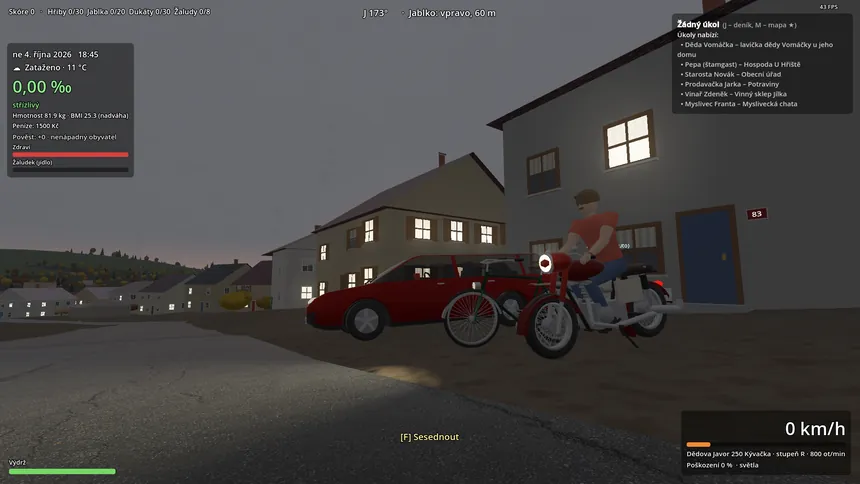</a>

### [HardCore Mode](https://github.com/pauliquib/HardCoreMode)
A platformer that runs entirely in the browser (vanilla JS, Canvas, Web Audio API), with its own map editor

### [InfoFlowLab](https://github.com/pauliquib/infoflowlab)
An interactive compression and communication simulator — a visual node editor with real-time data-flow simulation (Python, PySide6)

<a href="https://github.com/pauliquib/infoflowlab">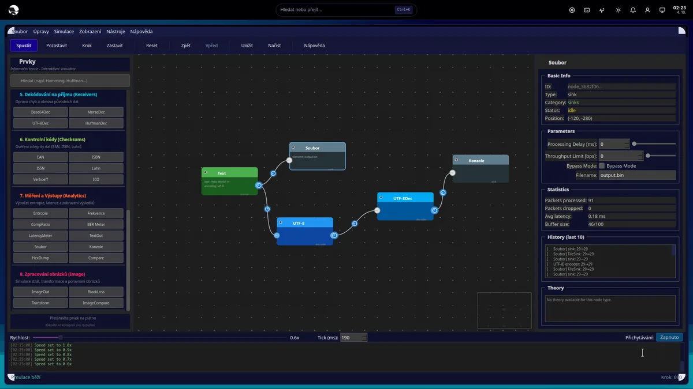</a>

### [Vlnky](https://github.com/pauliquib/Vlnky)
A KDE Plasma 6 wallpaper that renders the animated PSP XMB waves from `system_plugin_bg.rco` files (C++, Vulkan/OpenGL RHI)

### [Fedora-SecuriTUI](https://github.com/pauliquib/Fedora-SecuriTUI)
A TUI manager for diagnostic, security and pentest tools on Fedora KDE (bash, whiptail/dialog)

## Private projects

Internal / non-public repositories — code, configuration and internal documentation stay private.
A short overview without sensitive details (no credentials, internal IP addresses, customer data, etc.):

### Sencurio
A monorepo for assisted living and home safety monitoring (AAL / smart home): mmWave radar + ESP32-S3 edge devices, a Laravel backend, a Next.js dashboard, an Expo mobile app and a PySide6 desktop monitor. *Not labelled as a medical device.*
`PHP/Laravel` `TypeScript/Next.js` `Python/PySide6` `ESP-IDF` `MQTT`

 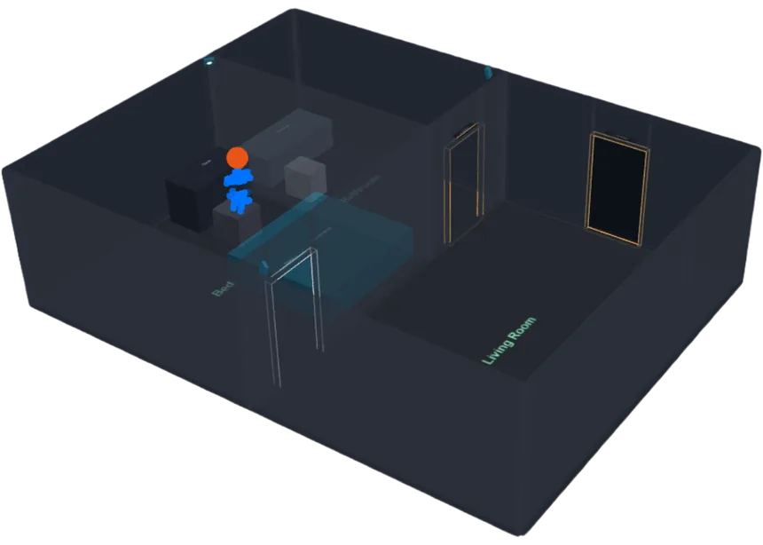

### Svec Studio
A desktop GUI/TUI work environment for Fedora: a kiosk shell (Wayland), a plugin API, a local AI agent and management of the static svec-elektro.cz website. A tool for my own daily use, not a product for distribution.
`Python` `PySide6/Qt` `JavaScript` `Rust`

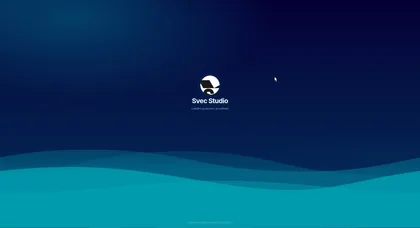 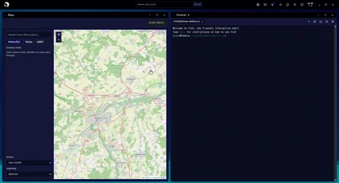 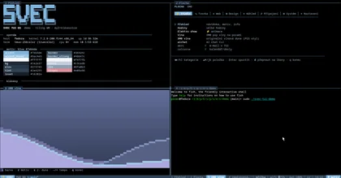 

### PRE2MULTI
An independent multiplayer engine (Godot 4) built on the physics of a classic DOS platformer, with a LAN deathmatch for 2–4 players. *BYOG (Bring Your Own Game)* — the repository contains no original game assets.
`GDScript` `Python`

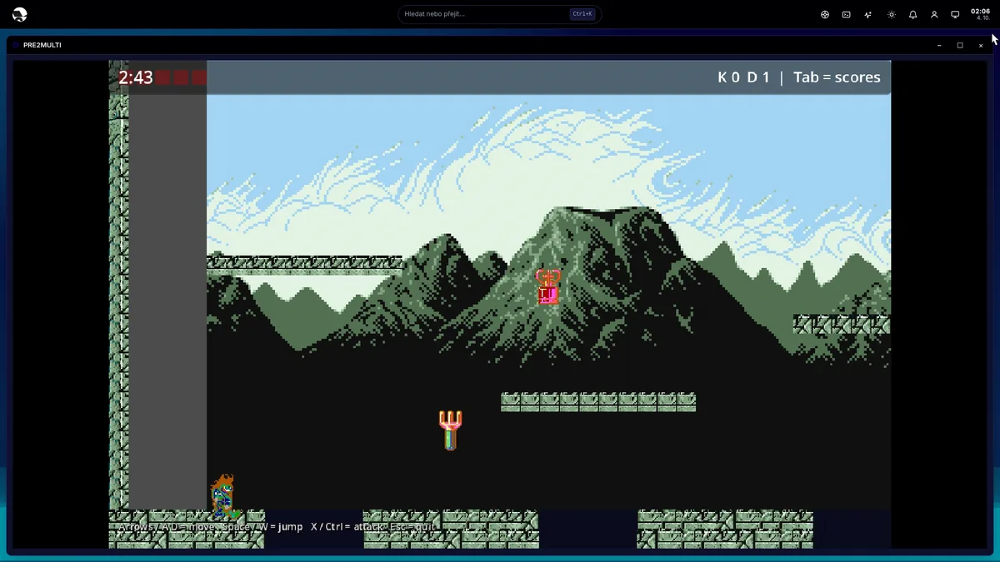

### K3X020 Nucleo
An STM32 Nucleo-H753ZI as a replacement controller for an industrial 24 V I/O board — hardware reverse engineering for my own workshop, with terminal documentation and RE findings.
`C` `STM32 HAL`

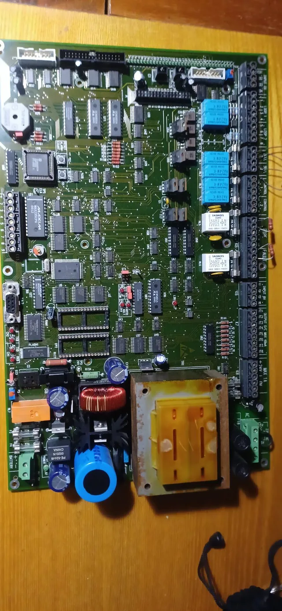 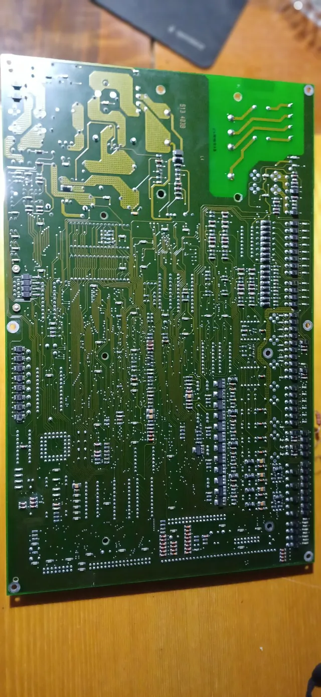

## Languages

A summary across **all** repositories, public and private (`stone-and-clay`, `HardCoreMode`, `infoflowlab`, `Vlnky`, `Fedora-SecuriTUI`, `svec-studio-fedora-theme`, `k3x020-nucleo`, `svec-studio`, `PRE2MULTI`, `sencurio-developer`), by bytes of code as counted by GitHub — no file contents are used. I excluded vendor libraries and third-party add-ons (STM32 HAL/CMSIS, ESP-IDF managed components, Godot add-ons, Three.js/floorplan3d JS libraries) with `.gitattributes` (`linguist-vendored`), so the graph reflects the code I wrote, not the SDKs and plugins I linked:

## Technologies

`Python` `JavaScript / TypeScript` `Rust` `PySide6 / Qt` `C++` `GDScript` `Bash` `STM32 / ESP32` `Godot` `Laravel` `Next.js`

🌐 **Web:** [svec-elektro.cz](https://svec-elektro.cz) · [sencurio.com](https://sencurio.com)
