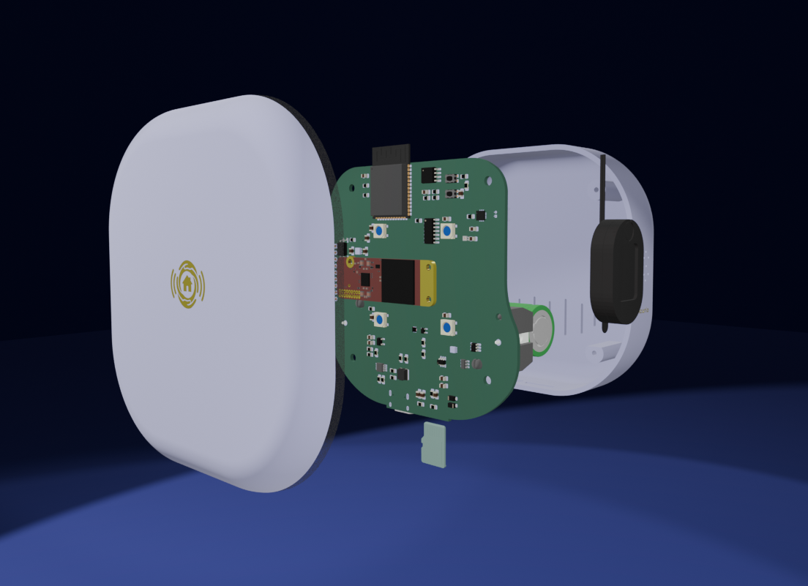
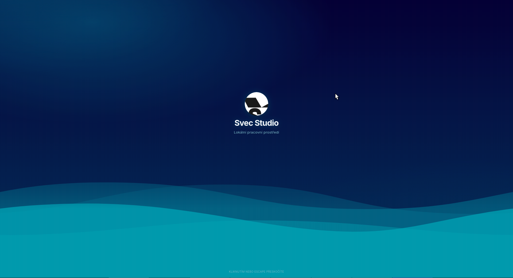
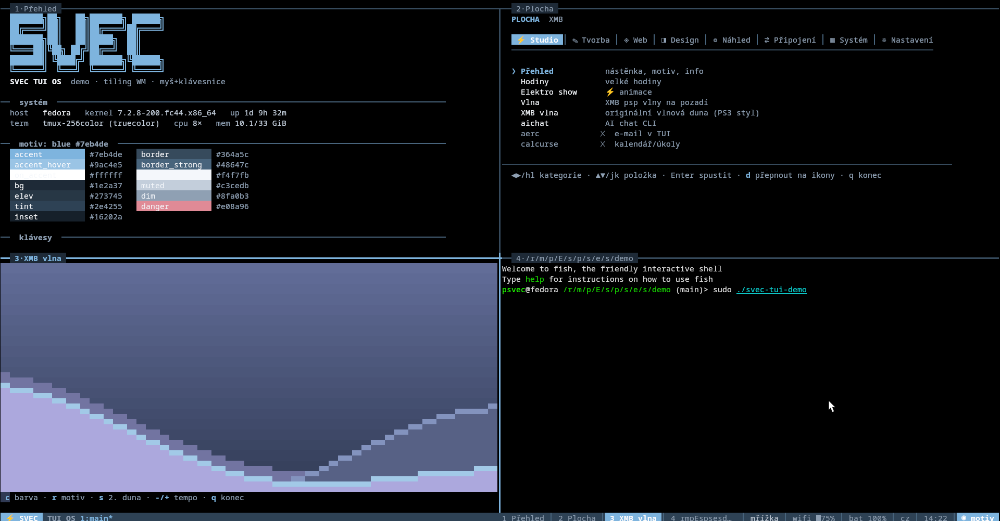
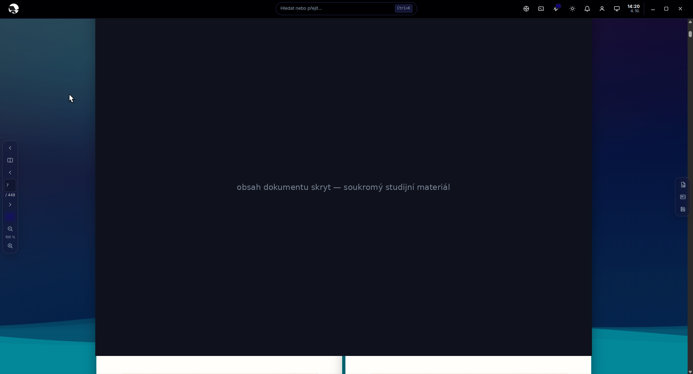
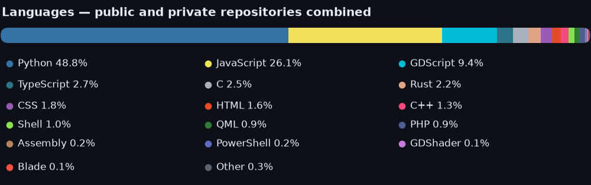

# pauliquib

Desktopové nástroje, embedded hardware a utilitky pro Linux/KDE.
*Desktop tools, embedded hardware and Linux/KDE utilities — mostly in Czech.*

## Veřejné projekty

### [Stone & Clay](https://github.com/pauliquib/stone-and-clay)
Open-world simulátor vesnice Dukelčice nad reálným katastrem — NPC dialogy, práce, dovednosti, počasí, zvěř, létání (Godot 4.3, GDScript)

### [HardCore Mode](https://github.com/pauliquib/HardCoreMode)
Plošinovková hra běžící čistě v prohlížeči (vanilla JS, Canvas, Web Audio API), vlastní editor map

### [InfoFlowLab](https://github.com/pauliquib/infoflowlab)
Interaktivní simulátor komprese a komunikace — vizuální editor uzlů se simulací toku dat v reálném čase (Python, PySide6)

### [Vlnky](https://github.com/pauliquib/Vlnky)
KDE Plasma 6 wallpaper renderující animované PSP XMB vlny z `system_plugin_bg.rco` souborů (C++, Vulkan/OpenGL RHI)

### [Fedora-SecuriTUI](https://github.com/pauliquib/Fedora-SecuriTUI)
TUI správce diagnostických, bezpečnostních a pentest nástrojů pro Fedora KDE (bash, whiptail/dialog)

## Privátní projekty

Interní / neveřejné repozitáře — kód, konfigurace a interní dokumentace zůstávají soukromé.
Stručný přehled bez citlivých detailů (bez credentials, interních IP adres, zákaznických dat apod.):

### Sencurio
Monorepo pro asistované bydlení a bezpečnostní přehled v domácnosti (AAL / smart home): mmWave radar + ESP32-S3 edge zařízení, Laravel backend, Next.js dashboard, Expo mobilní app a PySide6 desktop monitor. *Není značkováno jako zdravotnický prostředek.*
`PHP/Laravel` `TypeScript/Next.js` `Python/PySide6` `ESP-IDF` `MQTT`

 

### Svec Studio
Desktopové GUI/TUI pracovní prostředí pro Fedoru: kiosk shell (Wayland), plugin API, lokální AI agent, správa statického webu svec-elektro.cz. Nástroj pro vlastní denní provoz, ne produkt pro distribuci.
`Python` `PySide6/Qt` `JavaScript` `Rust`

   

### PRE2MULTI
Nezávislý multiplayer engine (Godot 4) nad fyzikou klasické DOS plošinovky, LAN deathmatch pro 2–4 hráče. *BYOG (Bring Your Own Game)* — repozitář neobsahuje originální herní assety.
`GDScript` `Python`

### K3X020 Nucleo
STM32 Nucleo-H753ZI jako náhradní řídicí jednotka průmyslové 24V I/O desky — reverse engineering hardwaru pro vlastní dílnu, dokumentace svorek a RE nálezů.
`C` `STM32 HAL`

 

## Jazyky

Souhrn přes **všechny** repozitáře, veřejné i privátní (`stone-and-clay`, `HardCoreMode`, `infoflowlab`, `Vlnky`, `Fedora-SecuriTUI`, `k3x020-nucleo`, `svec-studio`, `PRE2MULTI`, `sencurio-developer`) podle bajtů kódu dle GitHubu — žádný obsah souborů. U embedded projektů jsem vendor knihovny (STM32 HAL/CMSIS, ESP-IDF managed components, Three.js bundle) vyřadil pomocí `.gitattributes` (`linguist-vendored`), ať graf odpovídá skutečně napsanému kódu, ne nalinkovaným SDK:

## Technologie

`Python` `JavaScript / TypeScript` `Rust` `PySide6 / Qt` `C++` `GDScript` `Bash` `STM32 / ESP32` `Godot` `Laravel` `Next.js`

🌐 **Web:** [svec-elektro.cz](https://svec-elektro.cz) · [sencurio.com](https://sencurio.com)
